# Экзаменационные билеты по курсу «Информатика и ИКТ»

---

## Билет 1. Понятия: информатика, информация, данные. Виды информации. Действия с информацией

### 1. Основные понятия
* **Информатика** — фундаментальная комплексная научная дисциплина, изучающая структуру, общие свойства и закономерности создания, сбора, хранения, поиска, преобразования, передачи и использования информации с помощью аппаратно-программных средств вычислительной техники.
  Информатика традиционно состоит из трех неразрывных составляющих:
  * **Hardware** — аппаратно-техническое обеспечение (электронные схемы, микропроцессоры, периферия);
  * **Software** — алгоритмическое и программное обеспечение (ОС, утилиты, прикладные программы);
  * **Brainware** (или *Orgware*) — концептуально-методологическое, интеллектуальное и организационное обеспечение.
* **Данные** — зарегистрированные сигналы, символы или факты на материальном носителе, зафиксированные в формализованном виде, пригодном для передачи, интерпретации или автоматической обработки.
* **Информация** — результат смысловой интерпретации данных в контексте определенной задачи, снижающий степень неопределенности знаний об объекте или явлении.

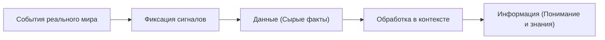

### 2. Виды информации
1. **По способу восприятия человеком (сенсорные каналы):**
   * *Зрительная (визуальная)* — воспринимается органом зрения (до 90% всей информации);
   * *Слуховая (аудиальная)* — речь, звуки, сигналы, музыка;
   * *Тактильная* — осязание (температура, текстура, давление);
   * *Обонятельная* и *вкусовая* — запахи и вкусовые ощущения.
2. **По форме компьютерного (знакового) представления:**
   * *Текстовая* (символы алфавита, слова, предложения);
   * *Числовая* (числа, математические величины);
   * *Графическая* (статические изображения, схемы, чертежи, фотографии);
   * *Звуковая* (аудиозаписи, оцифрованная речь);
   * *Видеоинформация* (мультимедиа, динамические видеоряды).

### 3. Свойства информации
* **Достоверность** — отражение истинного положения дел, отсутствие искажений;
* **Полнота** — достаточность для принятия обоснованного решения;
* **Актуальность** — своевременность и соответствие текущему моменту времени;
* **Ценность (полезность)** — способность решать поставленную задачу;
* **Понятность (ясность)** — представление на языке, доступном получателю;
* **Объективность** — независимость от чьего-либо субъективного мнения.

### 4. Действия с информацией (Информационные процессы)
1. **Сбор и восприятие:** фиксация первичных сведений датчиками или человеком.
2. **Хранение:** размещение на долговременных носителях (память, накопители) для отложенного использования.
3. **Обработка:** преобразование данных по заданным алгоритмам (вычисления, сортировка, фильтрация, перевод).
4. **Передача:** транспортировка сигналов от источника к приемнику по каналу связи.
5. **Защита:** обеспечение конфиденциальности, целостности и доступности информации.

---

## Билет 2. Кодирование информации. Равномерное и неравномерное кодирование, декодирование. Условие Фано. Примеры

### 1. Теоретические основы кодирования
* **Кодирование** — процесс преобразования информации из одной знаковой формы в другую с использованием определенного набора правил (кода) и алфавита.
* **Декодирование** — обратный процесс восстановления исходного сообщения из последовательности кодовых символов.
* **Алфавит кода** — конечное множество символов, используемых для представления информации (например, двоичный алфавит $\{0, 1\}$).

### 2. Равномерные и неравномерные коды
* **Равномерный код:** длина каждой кодовой комбинации постоянна ($l = \text{const}$).
  * Количество различных кодовых слов длины $l$ в $q$-ичном алфавите:
    $$N \le q^l$$
  * *Пример:* 8-битная кодировка ASCII ($2^8 = 256$ символов), 16-битный Unicode ($2^{16} = 65536$).
* **Неравномерный код:** кодовые слова для разных символов имеют разную длину.
  * Применяется для статистического сжатия данных: более частые символы получают более короткие коды (код Морзе, код Хаффмана).

### 3. Однозначность декодирования и условие Фано
Для того чтобы неравномерный код мог декодироваться однозначно слева направо без специальных разделителей, необходимо выполнение **прямого условия Фано**:
> **Прямое условие Фано:** Ни одно кодовое слово не должно являться префиксом (началом) другого кодового слова.
> 
> **Обратное условие Фано:** Ни одно кодовое слово не должно являться суффиксом (окончанием) другого кодового слова (позволяет однозначно декодировать сообщение справа налево).

Коды, удовлетворяющие условию Фано, называются **префиксными**.

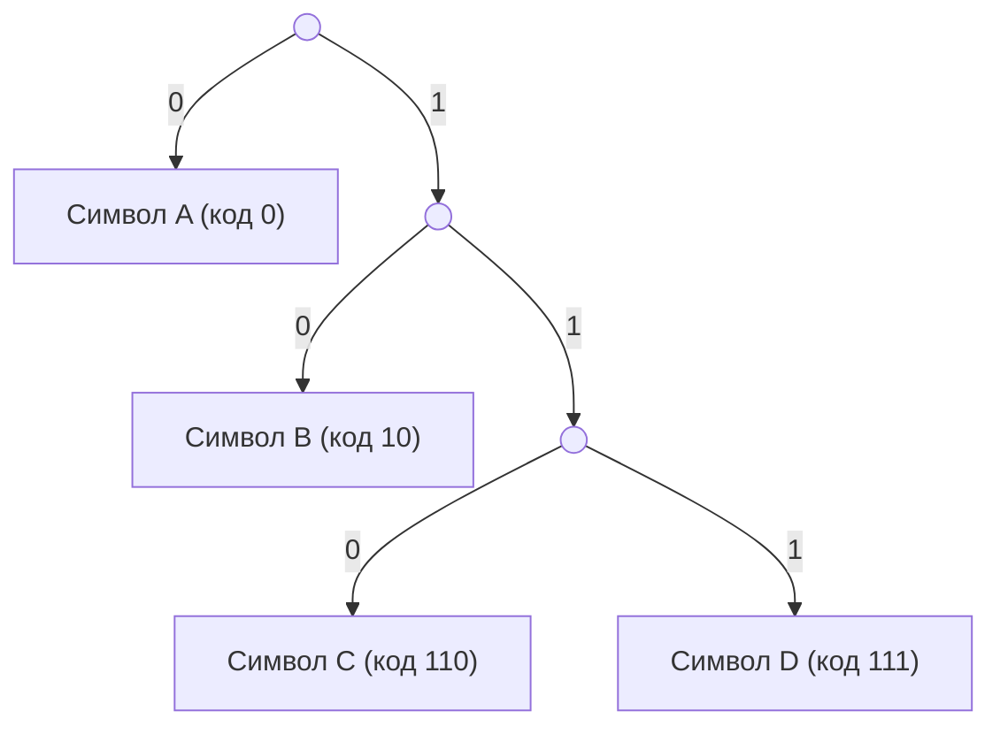

### 4. Пример задачи на условие Фано
**Задача:** Для кодирования букв $A, B, C, D$ используется неравномерный двоичный код, удовлетворяющий прямому условию Фано. Для букв $A, B, C$ заданы коды: $A \to 0$, $B \to 10$, $C \to 110$. Определите минимальный по длине код для буквы $D$.
* **Решение:**
  * Код не может начинаться с `0`, иначе он начнется с кода буквы $A$. Значит, первый символ — `1`.
  * Если код начинается с `10`, он содержит префикс буквы $B$. Значит, первые два символа — `11`.
  * Если третий символ — `0`, получим `110`, что совпадает с кодом $C$.
  * Следовательно, единственный свободный двоичный код длины 3 — это `111`.
* **Ответ:** `111`.

---

## Билет 3. Измерение информации. Количество информации и вероятность. Содержательный и алфавитный подход к измерению информации. Примеры задач

### 1. Алфавитный подход к измерению информации
При алфавитном подходе информационный объем сообщения зависит исключительно от мощности используемого алфавита и длины сообщения в символах, не учитывая его смысловое содержание.
* **Формула Хартли:** если алфавит состоит из $N$ равновероятных символов, то информационный вес одного символа $i$ (в битах) определяется соотношением:
  $$N = 2^i \implies i = \log_2 N$$
* **Информационный объем текста** длины $K$ символов:
  $$I = K \cdot i = K \cdot \log_2 N \text{ (бит)}$$

**Единицы измерения информации:**
$$1 \text{ Байт} = 8 \text{ бит} = 2^3 \text{ бит}$$
$$1 \text{ Кбайт} = 1024 \text{ Байт} = 2^{10} \text{ Байт}$$
$$1 \text{ Мбайт} = 1024 \text{ Кбайт} = 2^{20} \text{ Байт}$$
$$1 \text{ Гбайт} = 1024 \text{ Мбайт} = 2^{30} \text{ Байт}$$

### 2. Содержательный (вероятностный) подход
Количество информации рассматривается как мера уменьшения неопределенности наших знаний после свершения некоторого события.
* Если событие имеет вероятность $p$, то количество информации в сообщении о его наступлении:
  $$I = \log_2 \frac{1}{p} = -\log_2 p$$
* **Формула Шеннона** для системы из $n$ возможных исходов с вероятностями $p_1, p_2, \dots, p_n$ (где $\sum_{k=1}^n p_k = 1$):
  $$H = -\sum_{k=1}^n p_k \log_2 p_k$$
  Величина $H$ называется **информационной энтропией** источника.

### 3. Примеры задач
* **Задача 1 (Алфавитный подход):** Книга содержит 16 страниц, на каждой странице 32 строки по 64 символа в строке. Текст записан с помощью 256-символьного алфавита. Определить объем текста в килобайтах.
  * *Решение:*
    1. Мощность алфавита $N = 256 = 2^8$, значит $i = 8 \text{ бит} = 1 \text{ байт}$.
    2. Общее число символов $K = 16 \times 32 \times 64 = 2^4 \times 2^5 \times 2^6 = 2^{15}$ символов.
    3. Объем $I = K \times 1 \text{ байт} = 2^{15} \text{ байт} = \frac{2^{15}}{2^{10}} \text{ Кбайт} = 2^5 \text{ Кбайт} = 32 \text{ Кбайт}$.
  * *Ответ:* $32 \text{ Кбайт}$.
* **Задача 2 (Содержательный подход):** В корзине лежат 8 белых и 24 черных шара. Сколько информации несет сообщение о том, что наугад достали белый шар?
  * *Решение:*
    1. Общее количество шаров: $8 + 24 = 32$.
    2. Вероятность достать белый шар: $p = \frac{8}{32} = \frac{1}{4} = 2^{-2}$.
    3. Количество информации: $I = -\log_2(2^{-2}) = 2 \text{ бита}$.
  * *Ответ:* $2 \text{ бита}$.

---

## Билет 4. Системы счисления. Типы систем счисления. Перевод чисел из одной системы счисления в другую. Взаимосвязь между двоичной, восьмеричной и шестнадцатеричной с. с. Примеры

### 1. Понятие и классификация систем счисления
**Система счисления (С.С.)** — совокупность приемов и правил именования и обозначения чисел с помощью определенного набора знаков (цифр).
* **Непозиционные:** количественный эквивалент цифры не зависит от ее позиции в числе.
  * *Пример:* Римская система ($X = 10$, $XX = 20$).
* **Позиционные:** вес цифры определяется ее позицией (разрядом) в числе.
  * Характеризуются **основанием** $q$ — количеством уникальных цифр.
  * Развернутая форма записи числа:
    $$A_q = \pm \sum_{k=-m}^{n-1} a_k \cdot q^k = a_{n-1} q^{n-1} + \dots + a_1 q^1 + a_0 q^0 + a_{-1} q^{-1} + \dots + a_{-m} q^{-m}$$

### 2. Алгоритмы перевода чисел
1. **Из системы с основанием $q$ в десятичную:** вычисление значения развернутой формы числа.
   $$101101_2 = 1 \cdot 2^5 + 0 \cdot 2^4 + 1 \cdot 2^3 + 1 \cdot 2^2 + 0 \cdot 2^1 + 1 \cdot 2^0 = 32 + 8 + 4 + 1 = 45_{10}$$
2. **Из десятичной системы в систему с основанием $q$:**
   * *Для целой части:* последовательное деление числа на $q$ нацело с фиксацией остатков до получения частного 0. Остатки записываются в обратном порядке.
   * *Пример:* $45_{10} \to 45 / 2 = 22$ (ост. 1), $22 / 2 = 11$ (ост. 0), $11 / 2 = 5$ (ост. 1), $5 / 2 = 2$ (ост. 1), $2 / 2 = 1$ (ост. 0), $1 / 2 = 0$ (ост. 1) $\implies 101101_2$.

### 3. Взаимосвязь $2$-ичной, $8$-ичной и $16$-ичной систем
Так как основания кратны степеням двойки ($8 = 2^3$, $16 = 2^4$), перевод осуществляется через группы разрядов:
* **Триады ($2 \leftrightarrow 8$):** каждой восьмеричной цифре соответствует три двоичных бита.
* **Тетрады ($2 \leftrightarrow 16$):** каждой шестнадцатеричной цифре соответствует четыре двоичных бита.

| $10$-ичная | $2$-ичная | $8$-ичная | $16$-ичная |
|:---:|:---:|:---:|:---:|
| 0 | 0000 | 0 | 0 |
| 1 | 0001 | 1 | 1 |
| 7 | 0111 | 7 | 7 |
| 8 | 1000 | 10 | 8 |
| 10 | 1010 | 12 | A |
| 15 | 1111 | 17 | F |

* **Пример перевода:** перевести $11010110_2$ в $8$-ичную и $16$-ичную системы.
  * В 8-ичную (разбиение справа по 3 бита): $\underbrace{011}_{3}\,\underbrace{010}_{2}\,\underbrace{110}_{6} \implies 326_8$.
  * В 16-ичную (разбиение справа по 4 бита): $\underbrace{1101}_{\text{D}}\,\underbrace{0110}_{6} \implies \text{D}6_{16}$.

---

## Билет 5. Арифметические действия в системах счисления. Правила, примеры

### 1. Правила двоичной арифметики
Арифметика в позиционных системах подчиняется тем же законам, что и в десятичной: сложение и умножение производятся поразрядно с переносом в старший разряд при превышении основания.

* **Таблица сложения:**
  $$0 + 0 = 0,\quad 0 + 1 = 1,\quad 1 + 0 = 1,\quad 1 + 1 = 10_2 \text{ (0 и перенос 1 в старший разряд)}$$
  $$1 + 1 + 1 = 11_2 \text{ (1 и перенос 1)}$$
* **Таблица вычитания:**
  $$0 - 0 = 0,\quad 1 - 0 = 1,\quad 1 - 1 = 0,\quad 10_2 - 1 = 1 \text{ (с заемом из старшего разряда)}$$
* **Таблица умножения:**
  $$0 \times 0 = 0,\quad 0 \times 1 = 0,\quad 1 \times 0 = 0,\quad 1 \times 1 = 1$$

### 2. Примеры вычислений в столбик
1. **Сложение в двоичной системе:**
   $$\begin{array}{r@{\quad}l}
     & 101101_2 \quad (45_{10}) \\
   + & 011011_2 \quad (27_{10}) \\
   \hline
     & 1001000_2 \quad (72_{10})
   \end{array}$$
2. **Вычитание в двоичной системе:**
   $$\begin{array}{r@{\quad}l}
     & 110010_2 \quad (50_{10}) \\
   - & 010101_2 \quad (21_{10}) \\
   \hline
     & 011101_2 \quad (29_{10})
   \end{array}$$
3. **Умножение в двоичной системе:**
   $$\begin{array}{r@{\quad}l}
     & 1011_2 \quad (11_{10}) \\
   \times & 0101_2 \quad (5_{10}) \\
   \hline
     & 1011 \\
   + & 101100 \\
   \hline
     & 110111_2 \quad (55_{10})
   \end{array}$$

### 3. Представление отрицательных чисел (Дополнительный код)
В вычислительных системах операция вычитания заменяется сложением с числом в **дополнительном коде** (two's complement):
1. Записывается модуль числа в двоичной форме (прямой код).
2. Выполняется побитовая инверсия всех бит — замена 0 на 1 и 1 на 0 (обратный код).
3. К результату прибавляется единица: $\text{Доп. код} = \text{Инверсия}(X) + 1$.
Это исключает необходимость в отдельной аппаратной схеме вычитателя.

---

## Билет 6. Алгебра логики. Основные логические операции. Таблицы истинности. Примеры

### 1. Основные понятия математической логики
* **Высказывание** — повествовательное предложение, о котором можно однозначно утверждать, истинно оно ($1$) или ложно ($0$).
* **Логические связки (операции):**
  1. **Инверсия (НЕ, отрицание, $\neg A$, $\bar{A}$):** меняет значение на противоположное.
  2. **Конъюнкция (И, логическое умножение, $A \land B$, $A \cdot B$):** истинна тогда и только тогда, когда оба высказывания истинны.
  3. **Дизъюнкция (ИЛИ, логическое сложение, $A \lor B$, $A + B$):** ложна тогда и только тогда, когда оба высказывания ложны.
  4. **Импликация (следование, $A \to B$):** ложна только тогда, когда из истины следует ложь ($1 \to 0 = 0$).
  5. **Эквивалентность (равносильность, $A \leftrightarrow B$):** истинна, когда значения переменных совпадают.
  6. **Сложение по модулю 2 (XOR, строгое ИЛИ, $A \oplus B$):** истинна, когда значения переменных различны.

### 2. Сводная таблица истинности

| $A$ | $B$ | $\neg A$ | $A \land B$ | $A \lor B$ | $A \to B$ | $A \leftrightarrow B$ | $A \oplus B$ |
|:---:|:---:|:---:|:---:|:---:|:---:|:---:|:---:|
| 0 | 0 | 1 | 0 | 0 | 1 | 1 | 0 |
| 0 | 1 | 1 | 0 | 1 | 1 | 0 | 1 |
| 1 | 0 | 0 | 0 | 1 | 0 | 0 | 1 |
| 1 | 1 | 0 | 1 | 1 | 1 | 1 | 0 |

### 3. Основные законы логики
* **Законы де Моргана:**
  $$\neg(A \land B) = \neg A \lor \neg B, \qquad \neg(A \lor B) = \neg A \land \neg B$$
* **Дистрибутивность:**
  $$A \land (B \lor C) = (A \land B) \lor (A \land C), \qquad A \lor (B \land C) = (A \lor B) \land (A \lor C)$$
* **Закон двойного отрицания:** $\neg(\neg A) = A$.
* **Закон исключенного третьего:** $A \lor \neg A = 1$; **закон непротиворечия:** $A \land \neg A = 0$.

### 4. Пример построения таблицы истинности
Построить таблицу истинности для функции $F(A, B) = \neg A \lor (A \land B)$.

| $A$ | $B$ | $\neg A$ | $A \land B$ | $F = \neg A \lor (A \land B)$ |
|:---:|:---:|:---:|:---:|:---:|
| 0 | 0 | 1 | 0 | **1** |
| 0 | 1 | 1 | 0 | **1** |
| 1 | 0 | 0 | 0 | **0** |
| 1 | 1 | 0 | 1 | **1** |

*Упрощение аналитически:* $\neg A \lor (A \land B) = (\neg A \lor A) \land (\neg A \lor B) = 1 \land (\neg A \lor B) = \neg A \lor B = A \to B$.

---

## Билет 7. Логические основы компьютера. Функциональные схемы логических устройств. Примеры

### 1. Базовые логические элементы (вентили)
Логические устройства процессора строятся из полупроводниковых логических элементов:
* **НЕ (Инвертор):** 1 вход, 1 выход ($Y = \neg X$);
* **И (Конъюнктор):** 2+ входов, выход $1$ при всех единицах на входе ($Y = A \land B$);
* **ИЛИ (Дизъюнктор):** 2+ входов, выход $1$ при наличии хотя бы одной единицы ($Y = A \lor B$);
* **XOR (Исключающее ИЛИ):** формирует сумму по модулю 2.

### 2. Полусумматор (Half Adder)
Логическое устройство, выполняющее сложение двух одноразрядных двоичных чисел $A$ и $B$ с формированием бита суммы $S$ и бита переноса $P$:
* Сумма: $S = A \oplus B$
* Перенос: $P = A \land B$

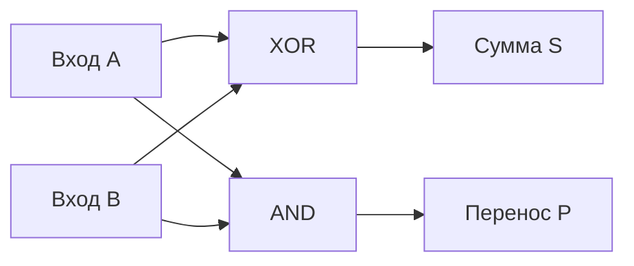

### 3. Полный сумматор и триггер
* **Полный сумматор (Full Adder):** принимает 3 входа ($A, B$ и перенос из младшего разряда $P_{in}$) и выдает $S$ и $P_{out}$. Строится на базе двух полусумматоров и логического элемента ИЛИ. Каскад полных сумматоров формирует многоразрядный сумматор АЛУ.
* **RS-триггер:** элементарная ячейка статической оперативной памяти (SRAM), способная сохранять 1 бит информации благодаря обратной связи на элементах ИЛИ-НЕ (или И-НЕ):
  * Вход $S$ (Set) — установка в 1;
  * Вход $R$ (Reset) — сброс в 0;
  * $R=0, S=0$ — режим хранения состояния;
  * $R=1, S=1$ — запрещенная комбинация.

---

## Билет 8. Основные устройства компьютера. Характеристики. Схема фон Неймана. Периферийные устройства компьютера

### 1. Архитектура и принципы Джона фон Неймана (1945 г.)
1. **Принцип двоичного кодирования:** вся информация (данные и команды) кодируется в двоичном виде.
2. **Принцип однородности памяти:** программы и данные хранятся в общем адресном пространстве памяти.
3. **Принцип адресности памяти:** память состоит из пронумерованных ячеек, процессор имеет прямой доступ к любой ячейке по ее адресу.
4. **Принцип программного управления:** выполнение инструкций программы контролируется процессором последовательно во времени.

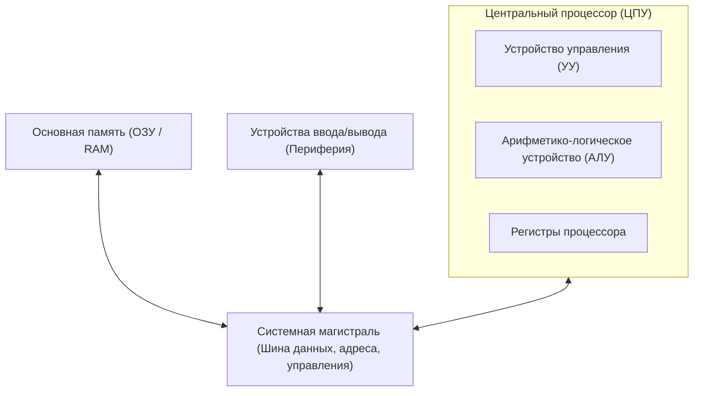

### 2. Центральные устройства и их характеристики
* **Процессор (CPU):**
  * *Тактовая частота* (ГГц) — число базовых операций в секунду;
  * *Разрядность* (32 / 64 бит) — объем данных, обрабатываемых за один такт;
  * *Количество ядер* и размер кэш-памяти (L1, L2, L3).
* **Память:**
  * *Внутренняя:* ОЗУ (RAM — энергозависимая оперативная память), ПЗУ (ROM/BIOS — постоянная память);
  * *Внешняя:* SSD (твердотельные накопители), HDD (магнитные диски), оптические диски.

### 3. Периферийные устройства
* **Ввода:** клавиатура, мышь, графический планшет, сканер, микрофон, веб-камера.
* **Вывода:** монитор, принтер, плоттер (графопостроитель), звуковые колонки.
* **Связи и коммуникации:** сетевые адаптеры (Ethernet, Wi-Fi), модемы.

---

## Билет 9. Программное обеспечение компьютера. Виды ПО. Файловая система. Операционная система

### 1. Классификация программного обеспечения (ПО)
* **Системное ПО:**
  * *Операционные системы (ОС)*;
  * *Драйверы* устройств;
  * *Утилиты* (архиваторы, дефрагментаторы, антивирусы).
* **Прикладное ПО:** программы для решения пользовательских задач (офисные пакеты, графические редакторы, браузеры, СУБД, игры).
* **Инструментальное ПО (системы программирования):** компиляторы, интерпретаторы, линкеры, отладчики и интегрированные среды разработки (IDE: VS Code, PyCharm).

### 2. Операционная система (ОС)
Комплекс системных программ, обеспечивающий управление аппаратными ресурсами компьютера, выполнение прикладных программ и взаимодействие с пользователем.
* **Основные компоненты:** ядро (управление памятью, процессами, прерываниями), драйверы, файловая система, интерфейс пользователя (GUI или CLI).

### 3. Файловая система (ФС)
Порядок организации, хранения и именования файлов на носителях информации.
* **Файл** — поименованная область данных на носителе. Имеет имя и расширение (например, `document.docx`), определяющее тип файла.
* **Иерархическая (древовидная) структура:** корневой каталог $\to$ подкаталоги $\to$ файлы.
* **Путь к файлу:**
  * *Абсолютный путь:* от корня диска (`C:\School\Informatics\tickets.md`);
  * *Относительный путь:* от текущего рабочего каталога (`.\tickets.md`).
* **Популярные ФС:** NTFS (Windows), ext4 (Linux), APFS (macOS), FAT32/exFAT (флеш-накопители).

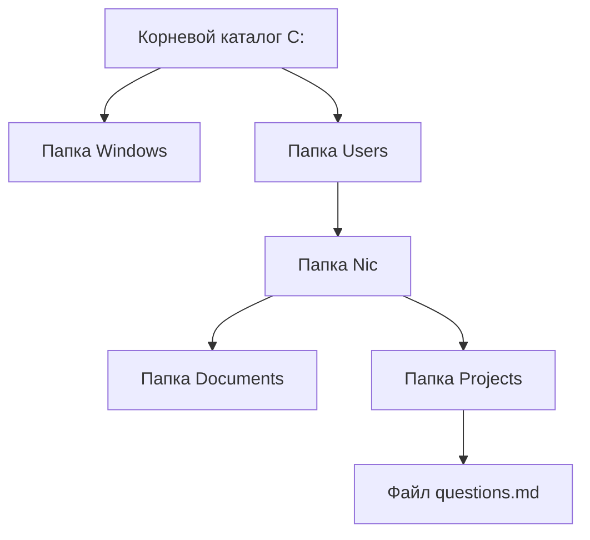

---

## Билет 10. Компьютерные вирусы и антивирусные программы

### 1. Понятие вредоносного ПО (Malware)
Компьютерный вирус — программа, способная к саморазмножению, внедрению в код других программ и системные области, а также к выполнению несанкционированных действий (уничтожение данных, шпионаж, вымогательство).

### 2. Разновидности вредоносных программ
* **Сетевые черви (Worms):** распространяются самостоятельно по сетям через уязвимости без участия пользователя.
* **Троянские программы (Trojans):** маскируются под полезный софт для кражи паролей, установки бэкдоров.
* **Программы-вымогатели (Ransomware):** шифруют файлы пользователя и требуют выкуп за ключ расшифровки.
* **Шпионское ПО (Spyware):** тайно фиксирует нажатия клавиш (keylogger) и отправляет данные злоумышленникам.
* **Руткиты (Rootkits):** скрывают присутствие вредоносного кода в ядре операционной системы.

### 3. Классификация и принципы работы антивирусных программ
* **По функционалу:**
  * *Сторожа (мониторы)* — постоянно находятся в ОЗУ и проверяют файлы в режиме реального времени;
  * *Сканеры (детекторы)* — проверяют память и диски по требованию или расписанию;
  * *Доктора (фаги)* — лечат зараженные файлы, удаляя вирусное тело;
  * *Ревизоры* — фиксируют контрольные суммы файлов и предупреждают о несанкционированных изменениях.
* **Методы анализа:**
  * *Сигнатурный анализ:* поиск известных шаблонов байтов вируса по базе данных;
  * *Эвристический анализ:* анализ подозрительного кода на наличие опасных паттернов действий;
  * *Поведенческий мониторинг (песочницы / Sandbox):* запуск программы в изолированной среде для оценки безопасности.

### 4. Профилактика заражений
Использование лицензионных антивирусов с постоянным обновлением баз, своевременная установка обновлений безопасности ОС, регулярное резервное копирование (бэкапы) по правилу 3-2-1, осторожность при работе с незнакомыми вложениями и ссылками в электронной почте.

---

## Билет 11. Понятие алгоритма. Свойства, способы записи алгоритма. Виды алгоритмов. Примеры

### 1. Понятие алгоритма и исполнителя
* **Алгоритм** — понятное и точное предписание исполнителю совершить строго определенную последовательность действий, направленных на достижение поставленной цели или решение задачи за конечное число шагов.
* **Исполнитель алгоритма** — человек или техническое устройство (робот, процессор), способный понимать и выполнять команды алгоритма.
* **Система команд исполнителя (СКИ)** — полный перечень всех элементарных команд, которые данный исполнитель может корректно интерпретировать и исполнить.

### 2. Свойства алгоритма
1. **Дискретность** — процесс решения задачи разбит на последовательность отдельных элементарных шагов (действий).
2. **Понятность** — каждая команда входит в СКИ исполнителя.
3. **Определенность (детерминированность)** — однозначность толкования команд; при одинаковых исходных данных алгоритм всегда дает один и тот же результат.
4. **Результативность (конечность)** — алгоритм должен обязательно завершиться за конечное число шагов с получением результата или сообщением о невозможности решения.
5. **Массовость** — применимость алгоритма к целому классу однотипных задач с различными начальными данными.

### 3. Способы записи алгоритмов
* **Словесный (естественный язык)** — кулинарные рецепты, инструкции по технике безопасности;
* **Графический (блок-схемы)** — наглядное представление с помощью геометрических фигур по ГОСТ 19.701-90;
* **Псевдокод (алгоритмический язык)** — промежуточный структурированный язык описания логики;
* **Язык программирования** — строгая формальная запись для исполнения на ЭВМ.

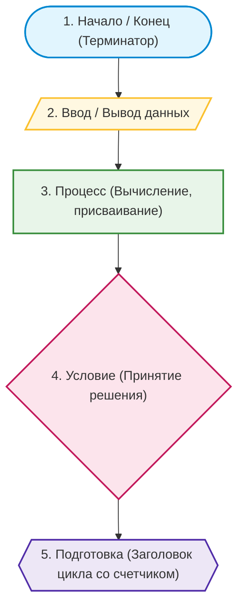

### 4. Базовые алгоритмические конструкции (виды алгоритмов)
* **Линейный:** шаги выполняются строго последовательно один за другим, без условий и повторений.
* **Разветвляющийся:** в зависимости от истинности логического условия выбирается одна из альтернативных ветвей вычислений.
* **Циклический:** последовательность действий многократно повторяется при соблюдении некоторого условия или фиксированное число раз.

---

## Билет 12. Язык программирования Pascal (Python). Структура программы

### 1. Архитектура и структура исходного кода
В современном обучении стандартом являются два языка: компилируемый строго типизированный **Pascal** (PascalABC.NET / Free Pascal) и интерпретируемый динамический **Python**.

#### Структура программы на языке Pascal
Программа на языке Pascal имеет строгую блочную структуру:
```pascal
program SumOfTwo;       // Заголовок программы

uses                    // Раздел подключения модулей
  Math;

const                   // Раздел именованных констант
  PI_CONST = 3.14159;

var                     // Раздел объявления переменных и их типов
  a, b, sum: integer;

begin                   // Начало исполняемого блока
  Write('Введите два целых числа: ');
  ReadLn(a, b);
  sum := a + b;
  WriteLn('Сумма чисел: ', sum);
end.                    // Точка завершает программу
```

#### Структура программы на языке Python
Python не требует предварительного объявления переменных, использует отступы (4 пробела) вместо операторных скобок `begin ... end` и исполняется интерпретатором построчно:
```python
# Модули подключаются через директиву import
import math

# Константы (по соглашению PEP 8 пишутся в UPPER_CASE)
PI_CONST = 3.14159

# Основной исполняемый код
def main():
    a = int(input("Введите первое целое число: "))
    b = int(input("Введите второе целое число: "))
    total = a + b
    print(f"Сумма чисел: {total}")

if __name__ == "__main__":
    main()
```

### 2. Сравнение парадигм компиляции и интерпретации
* **Компиляция (Pascal, C++):** исходный код преобразуется компилятором целиком в машинный код (бинарный исполняемый файл `.exe`). Высокая скорость выполнения, раннее обнаружение ошибок на этапе сборки.
* **Интерпретация (Python):** исходный код исполняется построчно виртуальной машиной. Гибкость, переносимость между ОС без перекомпиляции, но более низкая скорость чистых числовых расчетов.

---

## Билет 13. Элементы языка, типы данных. Операции, функции, выражения. Оператор присваивания, ввод и вывод данных

### 1. Алфавит языка и базовые типы данных
* **Идентификаторы:** имена переменных, констант, функций (начинаются с латинской буквы или `_`, не могут совпадать со служебными словами).

| Тип данных | Pascal | Python | Диапазон значений / Описание |
|:---|:---|:---|:---|
| **Целочисленный** | `integer` / `int64` | `int` | Целые числа (в Python размер неограничен) |
| **Вещественный** | `real` / `double` | `float` | Числа с плавающей точкой IEEE 754 |
| **Символьный** | `char` | `str` (длины 1) | Одиночный символ в кодировке |
| **Строковый** | `string` | `str` | Текстовая строка произвольной длины |
| **Логический** | `boolean` | `bool` | Значения `True` (Истина) или `False` (Ложь) |

### 2. Операции и выражения
* **Арифметические операции:**
  * Сложение `+`, вычитание `-`, умножение `*`.
  * Вещественное деление: `/`.
  * Целочисленное деление: `div` (Pascal), `//` (Python).
  * Остаток от деления: `mod` (Pascal), `%` (Python).
  * Возведение в степень: `**` (Python), функция `Power(a, b)` (Pascal).
* **Логические операции:** `and`, `or`, `not` (в Pascal: `and`, `or`, `not`, `xor`).
* **Операции сравнения:** `=`, `<>`, `<`, `>`, `<=`, `>=` (в Python: `==`, `!=`, `<`, `>`, `<=`, `>=`).

### 3. Оператор присваивания, ввод и вывод
* **Присваивание:** вычисляет значение выражения справа и сохраняет в переменную слева:
  * В Pascal: `x := a + 2 * b;`
  * В Python: `x = a + 2 * b`
* **Ввод данных:**
  * Pascal: `Read(x);` или `ReadLn(x, y);` (чтение с переходом на новую строку).
  * Python: `x = int(input())` или `a, b = map(int, input().split())`.
* **Вывод данных:**
  * Pascal: `WriteLn('Результат: ', x:0:2);` (с форматированием дробной части).
  * Python: `print(f"Результат: {x:.2f}")`.

---

## Билет 14. Программирование линейных алгоритмов. Блок-схема. Целочисленная арифметика. Примеры

### 1. Сущность линейного алгоритма
Линейный алгоритм содержит команды, выполняющиеся строго одна за другой в порядке их следования в программе, без ветвлений и повторений.

### 2. Целочисленная арифметика и выделение цифр числа
Пусть $n$ — натуральное число в десятичной системе:
* Последняя цифра числа: $n \bmod 10$ (`n % 10` в Python, `n mod 10` в Pascal).
* Отбрасывание последней цифры: $n \operatorname{div} 10$ (`n // 10` в Python, `n div 10` в Pascal).
* Для трехзначного числа $n = \overline{abc}$:
  $$a = n \operatorname{div} 100, \quad b = (n \operatorname{div} 10) \bmod 10, \quad c = n \bmod 10$$

### 3. Блок-схема задачи нахождения суммы цифр трехзначного числа

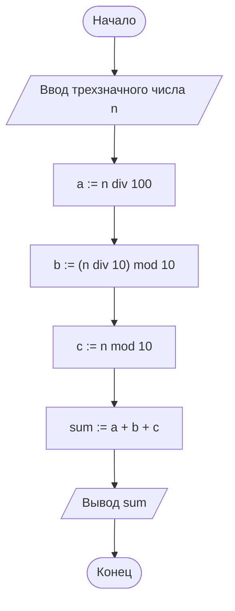

### 4. Программная реализация
* **Python:**
  ```python
n = int(input("Введите трехзначное число: "))
a = n // 100
b = (n // 10) % 10
c = n % 10
digit_sum = a + b + c
print("Сумма цифр:", digit_sum)

```
* **Pascal:**
  ```pascal
var
  n, a, b, c, sum: integer;
begin
  Write('Введите трехзначное число: ');
  ReadLn(n);
  a := n div 100;
  b := (n div 10) mod 10;
  c := n mod 10;
  sum := a + b + c;
  WriteLn('Сумма цифр: ', sum);
end.

```

---

## Билет 15. Программирование ветвлений. Блок-схема. Примеры

### 1. Формы ветвления
Ветвление обеспечивает выбор пути выполнения в зависимости от логического условия:
* **Неполная форма:** действие выполняется только при истинности условия:
  ```python
if condition:
    action()

```
* **Полная форма:** выбирается одна из двух альтернативных ветвей:
  ```python
if condition:
    action_true()
else:
    action_false()

```
* **Множественный выбор (каскадное ветвление):** проверка цепочки условий через `elif` (Python) или `case` (Pascal).

### 2. Блок-схема нахождения корней квадратного уравнения
Решение уравнения $ax^2 + bx + c = 0$ через дискриминант $D = b^2 - 4ac$:

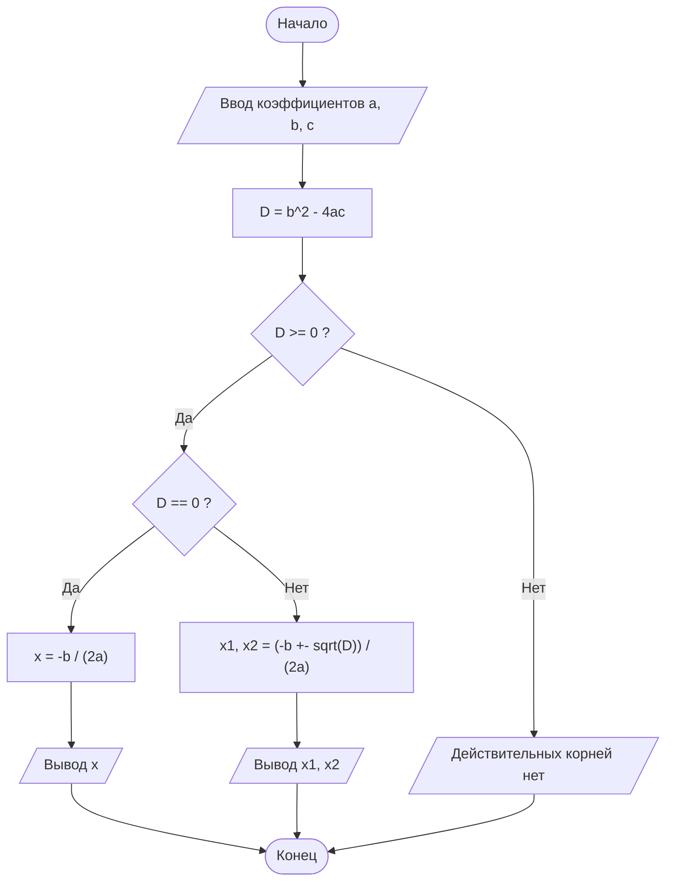

### 3. Программная реализация (Python и Pascal)
#### Реализация на Python:
```python
import math

a = float(input("a = "))
b = float(input("b = "))
c = float(input("c = "))

d = b**2 - 4 * a * c

if d > 0:
    x1 = (-b + math.sqrt(d)) / (2 * a)
    x2 = (-b - math.sqrt(d)) / (2 * a)
    print(f"Два корня: x1 = {x1:.3f}, x2 = {x2:.3f}")
elif d == 0:
    x = -b / (2 * a)
    print(f"Один корень: x = {x:.3f}")
else:
    print("Действительных корней нет")
```

#### Реализация на Pascal:
```pascal
program QuadraticEquation;

var
  a, b, c, d, x, x1, x2: real;

begin
  Write('Введите коэффициенты a, b, c: ');
  ReadLn(a, b, c);
  d := b * b - 4 * a * c;
  if d > 0 then
  begin
    x1 := (-b + Sqrt(d)) / (2 * a);
    x2 := (-b - Sqrt(d)) / (2 * a);
    WriteLn('Два корня: x1 = ', x1:0:3, ', x2 = ', x2:0:3);
  end
  else if d = 0 then
  begin
    x := -b / (2 * a);
    WriteLn('Один корень: x = ', x:0:3);
  end
  else
    WriteLn('Действительных корней нет');
end.
```

---

## Билет 16. Программирование циклов. Виды циклов. Блок-схема. Примеры

### 1. Классификация циклических алгоритмов
Цикл организует многократное повторение блока команд (тела цикла):
1. **Цикл со счетчиком (параметром) `for`:** количество повторений известно до начала цикла.
2. **Цикл с предусловием `while`:** условие проверяется перед выполнением тела цикла. Если условие ложно изначально, тело не выполнится ни разу.
3. **Цикл с постусловием `repeat ... until` (в Pascal):** условие проверяется после выполнения тела. Тело гарантированно выполняется хотя бы один раз.

### 2. Блок-схема цикла с предусловием (вычисление суммы ряда от 1 до N)

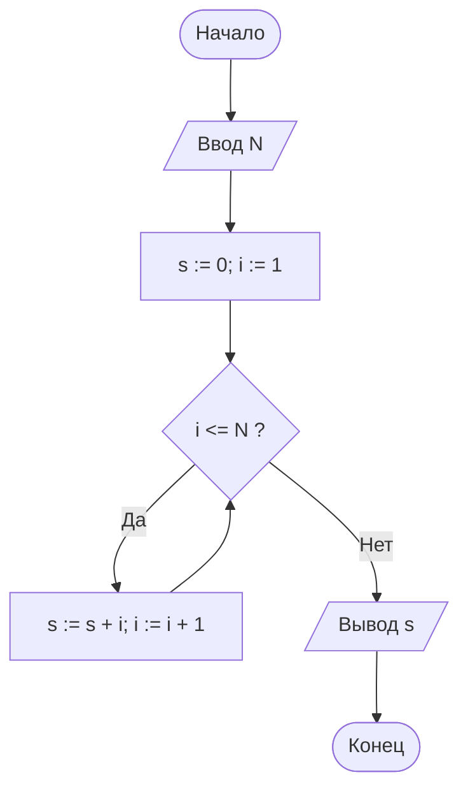

### 3. Примеры реализации на Python и Pascal (вычисление факториала $N! = 1 \times 2 \times \dots \times N$)
* **Python:**
  ```python
n = int(input("Введите N: "))
fact = 1
for i in range(1, n + 1):
    fact *= i
print(f"{n}! = {fact}")

```
* **Pascal:**
  ```pascal
var
  n, i: integer;
  fact: int64;
begin
  Write('Введите N: ');
  ReadLn(n);
  fact := 1;
  for i := 1 to n do
    fact := fact * i;
  WriteLn(n, '! = ', fact);
end.

```

---

## Билет 17. Сочетание циклов с ветвлением. Блок-схема. Примеры

### 1. Назначение и типовые паттерны
Сочетание циклов с условными конструкциями применяется в задачах обработки массивов и потоков данных:
* Фильтрация и селективное суммирование (например, сумма четных чисел);
* Подсчет количества элементов, удовлетворяющих критерию;
* Поиск экстремумов (максимума/минимума) в последовательности;
* Проверка чисел на простоту;
* Управление циклом: оператор `break` (немедленный выход) и `continue` (переход к следующей итерации).

### 2. Блок-схема проверки числа $N$ на простоту
Число называется простым, если оно больше 1 и не имеет делителей кроме 1 и самого себя.

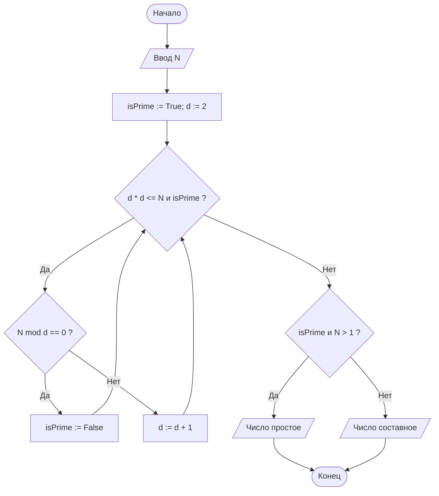

### 3. Программная реализация (подсчет суммы и количества четных чисел)
#### Реализация на Python:
```python
numbers = [12, 7, 19, 24, 5, 8, 31, 40]
even_sum = 0
even_count = 0

for x in numbers:
    if x % 2 == 0:
        even_sum += x
        even_count += 1

print(f"Четных чисел: {even_count}, Их сумма: {even_sum}")
```

#### Реализация на Pascal:
```pascal
program EvenCountAndSum;

var
  numbers: array[1..8] of integer = (12, 7, 19, 24, 5, 8, 31, 40);
  evenSum, evenCount, i: integer;

begin
  evenSum := 0;
  evenCount := 0;
  for i := 1 to 8 do
  begin
    if numbers[i] mod 2 = 0 then
    begin
      evenSum := evenSum + numbers[i];
      evenCount := evenCount + 1;
    end;
  end;
  WriteLn('Четных чисел: ', evenCount, ', Их сумма: ', evenSum);
end.
```

---

## Билет 18. Вспомогательные алгоритмы и подпрограммы. Процедуры без параметра, процедуры с параметром и функции. Примеры

### 1. Концепция декомпозиции и подпрограмм
* **Подпрограмма** — логически завершенный именованный фрагмент алгоритма, который может быть вызван из любой точки программы произвольное количество раз.
* **Преимущества:** декомпозиция сложной задачи на простые подзадачи, устранение дублирования кода (принцип DRY — *Don't Repeat Yourself*), улучшение читаемости и тестируемости.

### 2. Процедуры и функции
* **Функция:** подпрограмма, которая производит вычисления и возвращает в точку вызова значение через оператор `return` (в Python) или присвоением имени функции (в Pascal).
* **Процедура:** подпрограмма, выполняющая последовательность действий без обязательного возврата единственного результирующего значения (в Python процедуры оформляются как функции без оператора `return` или с `return None`).

### 3. Параметры и область видимости переменных
* **Формальные параметры:** переменные, объявленные в заголовке подпрограммы.
* **Фактические параметры (аргументы):** реальные значения или переменные, передаваемые в момент вызова.
* **Область видимости:**
  * *Локальные переменные:* существуют только внутри подпрограммы во время ее выполнения;
  * *Глобальные переменные:* объявлены на уровне основной программы и доступны повсюду.

### 4. Примеры реализации
#### Функция вычисления наибольшего общего делителя (Алгоритм Евклида) на Python:
```python
def gcd(a: int, b: int) -> int:
    """Возвращает НОД двух чисел по алгоритму Евклида."""
    while b != 0:
        a, b = b, a % b
    return a

x = 48
y = 18
print(f"НОД({x}, {y}) = {gcd(x, y)}")  # Вывод: 6
```

#### Процедура с параметрами на Pascal:
```pascal
program ProceduresDemo;

procedure PrintLine(ch: char; count: integer);
var
  i: integer;
begin
  for i := 1 to count do
    Write(ch);
  WriteLn;
end;

begin
  PrintLine('=', 30);
  WriteLn('   Информатика: Билет 18   ');
  PrintLine('-', 30);
end.
```

---

## Билет 19. Массивы. Правила описания на языке программирования. Одномерные массивы. Основные задачи на обработку одномерного массива. Примеры

### 1. Понятие массива
* **Массив** — упорядоченная структура данных фиксированного размера, состоящая из элементов одного типа, объединенных общим именем, доступ к которым осуществляется по индексу (порядковому номеру).
* **Свойства классического массива:** однотипность элементов, прямой доступ за $O(1)$ по индексу, непрерывное размещение в оперативной памяти.

### 2. Описание массивов
* **Pascal:** `var arr: array[1..100] of integer;`
* **Python:** вместо статических массивов используются динамические списки: `arr = [0] * 10` или `arr = [5, 8, -2, 14, 0]`.

### 3. Типовые алгоритмы обработки одномерного массива
1. **Поиск максимального элемента и его индекса:**
   ```python
arr = [14, 45, 12, 89, 34, 89, 21]
max_val = arr[0]
max_idx = 0

for i in range(1, len(arr)):
    if arr[i] > max_val:
        max_val = arr[i]
        max_idx = i

print(f"Максимум: {max_val}, Индекс: {max_idx}")

```
2. **Линейный поиск элемента:**
   ```python
target = 34
found_idx = -1
for i in range(len(arr)):
    if arr[i] == target:
        found_idx = i
        break

```
3. **Реверс массива на месте (двумя указателями):**
   ```python
left = 0
right = len(arr) - 1
while left < right:
    arr[left], arr[right] = arr[right], arr[left]
    left += 1
    right -= 1

```

---

## Билет 20. Вложенные циклы. Использование вложенных циклов на примере задач

### 1. Механизм работы вложенных циклов
Вложенным называется цикл, тело которого содержит другой цикл.
* **Внешний цикл** управляет глобальным шагом процесса;
* **Внутренний цикл** совершает полный оборот итераций на каждом единичном шаге внешнего цикла.
* Если внешний цикл выполняется $N$ раз, а внутренний — $M$ раз, то тело внутреннего цикла выполнится $N \times M$ раз (сложность $O(N \cdot M)$).

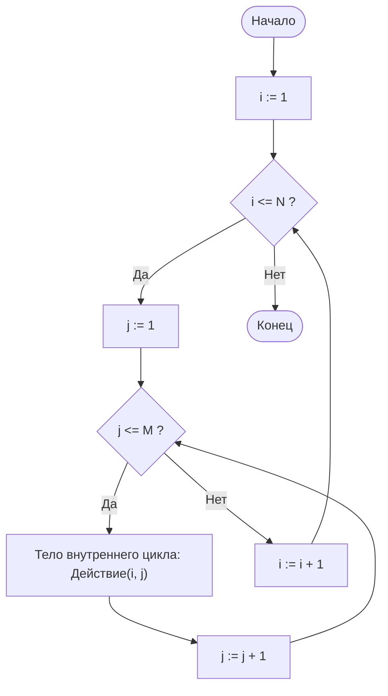

### 2. Типовые задачи на вложенные циклы
1. **Вывод таблицы умножения:**
   ```python
for i in range(1, 10):
    for j in range(1, 10):
        print(f"{i * j:4d}", end="")
    print()

```

2. **Обработка матриц (двумерных массивов):** нахождение суммы элементов матрицы $N \times M$:
   ```python
matrix = [
    [1, 2, 3],
    [4, 5, 6],
    [7, 8, 9]
]
total = 0
for row in matrix:
    for val in row:
        total += val
print("Сумма элементов матрицы:", total)

```

3. **Сортировка пузырьком (Bubble Sort):**
   ```python
arr = [64, 34, 25, 12, 22, 11, 90]
n = len(arr)
for i in range(n - 1):
    for j in range(n - 1 - i):
        if arr[j] > arr[j + 1]:
            arr[j], arr[j + 1] = arr[j + 1], arr[j]
print("Отсортированный массив:", arr)

```

---

## Билет 21. Кодирование графической и звуковой информации. Примеры задач

### 1. Кодирование растровой графической информации
Растровое изображение представляет собой прямоугольную матрицу пикселей (точек) размером $X \times Y$.
* **Глубина цвета ($i$ бит):** количество бит, выделяемое для кодирования цвета одного пикселя.
* **Количество цветов в палитре ($N$):** связано с глубиной цвета формулой Хартли:
  $$N = 2^i$$
* **Информационный объем несжатого растрового изображения ($I$):**
  $$I = X \cdot Y \cdot i \text{ (бит)}$$

**Основные цветовые модели:**
* **RGB (Red, Green, Blue):** аддитивная модель (смешение световых лучей). При 24-битном True Color на каждый канал отводится по 8 бит ($2^8 = 256$ градаций), общее число цветов: $2^{24} \approx 16.7 \times 10^6$.
* **CMYK (Cyan, Magenta, Yellow, blacK):** субтрактивная модель (поглощение света краской), используется в полиграфии.

### 2. Кодирование звуковой информации
Непрерывный звуковой сигнал преобразуется в дискретный с помощью аналого-цифрового преобразователя (АЦП):
1. **Частота дискретизации ($f$ Гц):** количество замеров амплитуды звуковой волны в одну секунду.
2. **Глубина квантования (разрешение, $b$ бит):** количество бит для записи значения амплитуды каждого замера.
3. **Количество каналов ($k$):** $k=1$ (моно), $k=2$ (стерео), $k=6$ (система 5.1).

* **Формула объема оцифрованного звукового файла ($I$):**
  $$I = f \cdot b \cdot k \cdot t \text{ (бит)}$$
  где $t$ — длительность звучания в секундах.

### 3. Примеры решения расчетных задач
* **Задача 1 (Графика):** Растровое изображение размером $1024 \times 768$ пикселей сохранено в формате с палитрой из 65536 цветов. Определить информационный объем файла в килобайтах.
  * *Решение:*
    1. Мощность палитры $N = 65536 = 2^{16} \implies i = 16 \text{ бит} = 2 \text{ байта}$.
    2. Количество пикселей: $X \times Y = 1024 \times 768 = 2^{10} \times 768$.
    3. Объем $I = 2^{10} \times 768 \times 2 \text{ байта} = \frac{2^{10} \times 1536}{2^{10}} \text{ Кбайт} = 1536 \text{ Кбайт} = 1.5 \text{ Мбайт}$.
  * *Ответ:* $1536 \text{ Кбайт}$.
* **Задача 2 (Звук):** Производится двухканальная (стерео) звукозапись с частотой дискретизации 48 кГц и 16-битным разрешением. Длительность записи составляет 1 минуту. Определить размер полученного несжатого аудиофайла в мегабайтах.
  * *Решение:*
    1. Параметры: $k = 2$, $f = 48\,000 \text{ Гц}$, $b = 16 \text{ бит} = 2 \text{ байта}$, $t = 60 \text{ с}$.
    2. Объем в байтах: $I = 48\,000 \times 2 \times 2 \times 60 = 11\,520\,000 \text{ байт}$.
    3. Перевод в мегабайты: $I = \frac{11\,520\,000}{1024 \times 1024} \approx 10.986 \text{ Мбайт}$.
  * *Ответ:* $\approx 11 \text{ Мбайт}$.

---

## Билет 22. Моделирование как метод познания. Материальные и информационные модели. Основные типы информационных моделей

### 1. Понятие модели и моделирования
* **Модель** — искусственно созданный объект, воспроизводящий существенные для поставленной цели свойства и характеристики исследуемого объекта-оригинала.
* **Моделирование** — метод познания и исследования объектов реального мира путем построения и изучения их моделей.
* **Цели моделирования:** исследование процессов, прогнозирование поведения систем, оптимизация параметров, управление сложными объектами в условиях невозможности прямых экспериментов.

### 2. Классификация моделей
1. **Материальные (натурные, физические):** имеют вещественное воплощение, воспроизводят геометрические или физические свойства оригинала (макет самолета в аэродинамической трубе, глобус, анатомический макет).
2. **Информационные:** описывают объект на языках кодирования информации (словесном, графическом, математическом).

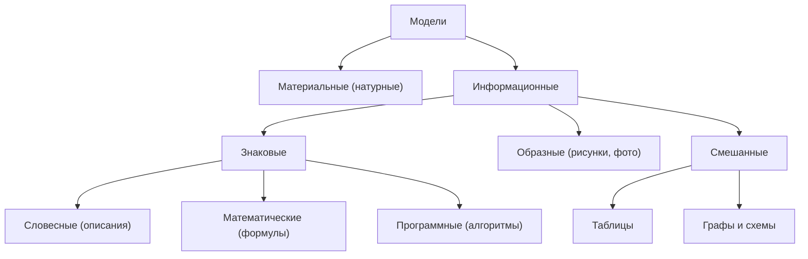

### 3. Основные типы информационных структур
* **Табличные:** упорядочивание данных в виде строк и столбцов (расписание уроков, матрицы).
* **Иерархические (деревья):** элементы связаны отношениями подчинения «предок — потомок» (файловая система, генеалогическое древо).
* **Сетевые (графы):** элементы могут быть произвольно связаны между собой (транспортные сети, Интернет, социальные сети).

### 4. Этапы компьютерного моделирования
1. Постановка задачи и определение целей моделирования.
2. Концептуальная и математическая формализация модели.
3. Разработка алгоритма и компьютерной программы (или выбор готового инструмента: Excel, CAD).
4. Проведение компьютерного эксперимента.
5. Анализ результатов, сопоставление с практикой и корректировка модели.

---

## Билет 23. Графы в моделировании. Примеры

### 1. Понятие графа и его элементы
* **Граф** $G = (V, E)$ — нелинейная структура данных, состоящая из множества **вершин** $V$ (узлов) и множества соединяющих их **ребер** $E$ (связей).
* **Виды графов:**
  * *Неориентированный:* ребра не имеют выделенного направления (двустороннее движение).
  * *Ориентированный (орграф):* ребра имеют направление (называются дугами, стрелками).
  * *Взвешенный:* каждому ребру сопоставлен вес (число: расстояние, стоимость, пропускная способность).
  * *Связный граф:* между любыми двумя вершинами существует хотя бы один путь.
  * *Дерево:* связный граф без циклов (содержит $N$ вершин и $N-1$ ребер).

### 2. Способы представления графов в ЭВМ
1. **Матрица смежности / весовая матрица:** квадратная таблица размера $N \times N$, где на пересечении строки $i$ и столбца $j$ стоит вес ребра $(i, j)$ или 0 при отсутствии ребра.
2. **Список смежности:** для каждой вершины хранится список смежных с ней вершин.

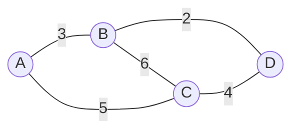

#### Примеры различных типов графов:
* **Ориентированный граф (орграф):**
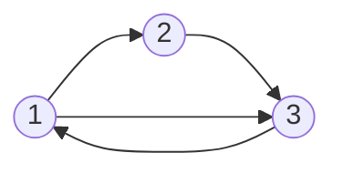
* **Дерево (иерархический граф без циклов):**
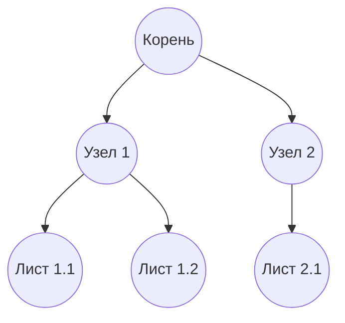

### 3. Пример задачи на поиск кратчайшего пути
**Задача:** Найти длину кратчайшего пути между пунктами $A$ и $D$ по заданной матрице расстояний:

| Пункт | A | B | C | D |
|:---:|:---:|:---:|:---:|:---:|
| **A** | | 3 | 5 | |
| **B** | 3 | | 6 | 2 |
| **C** | 5 | 6 | | 4 |
| **D** | | 2 | 4 | |

* **Решение:**
  Рассчитаем возможные несамопересекающиеся пути из $A$ в $D$:
  1. Путь $A \to B \to D$: длина $= 3 + 2 = 5$.
  2. Путь $A \to C \to D$: длина $= 5 + 4 = 9$.
  3. Путь $A \to B \to C \to D$: длина $= 3 + 6 + 4 = 13$.
  4. Путь $A \to C \to B \to D$: длина $= 5 + 6 + 2 = 13$.
  Минимальное расстояние равно 5 по маршруту $A \to B \to D$.
* **Ответ:** 5.

---

## Билет 24. Текстовый процессор. Способы создания, организации и преобразования текста. Преимущества компьютерного текста. Возможности ТР. Примеры

### 1. Текстовые редакторы и текстовые процессоры
* **Текстовый редактор (Notepad, nano):** предназначен для работы с неформатированным «чистым» текстом (plain text, кодировки ASCII, UTF-8).
* **Текстовый процессор (Microsoft Word, LibreOffice Writer):** мощный инструмент для создания сложных документов, содержащих развитое форматирование, таблицы, графику, стили и динамические поля.

### 2. Действия с текстом
* **Редактирование (правка содержания):** добавление, удаление, перемещение фрагментов текста, проверка орфографии и пунктуации, контекстный поиск и автоматическая замена.
* **Форматирование (внешний вид):**
  * *Уровень символа:* гарнитура шрифта (Times New Roman, Arial), кегль (размер), начертание (полужирный, курсив, подчеркивание), цвет, межзнаковый интервал.
  * *Уровень абзаца:* выравнивание (по левому краю, по центру, по правому краю, по ширине), отступ первой строки (красная строка), межстрочный интервал, отступы до и после абзаца.
  * *Уровень страницы:* ориентация (книжная/альбомная), размер полей (верхнее, нижнее, левое, правое), колонтитулы, нумерация страниц.

### 3. Возможности структурирования и автоматизации
* Использование **именованных стилей** (Заголовок 1, 2, 3, Обычный) позволяет одним кликом формировать автоматическое кликабельное оглавление;
* Вставка и форматирование таблиц, формул (LaTeX / Equation Editor), диаграмм, изображений с обтеканием текстом;
* Рецензирование: режим отслеживания исправлений и комментариев для совместной работы.

### 4. Преимущества компьютерного текста перед рукописным и печатным
Мгновенное тиражирование без потери качества, легкость внесения любых правок, автоматическая проверка орфографии, компактность хранения, глобальный поиск по тексту, защита паролем и цифровой подписью.

---

## Билет 25. Электронные таблицы. Назначение. Возможности электронных таблиц. Форматы и типы данных. Встроенные функции. Абсолютная и относительная адресации. Функция ЕСЛИ. Сортировка и фильтрация данных. Диаграммы. Примеры

### 1. Назначение и структура табличного процессора (Excel, Calc)
Электронные таблицы предназначены для автоматизации математических, статистических и экономических расчетов над структурированными данными.
* **Структура:** рабочий лист состоит из столбцов ($A, B, \dots, Z, AA, \dots$) и строк ($1, 2, \dots$). Пересечение образует **ячейку** с уникальным адресом (например, $B4$).
* **Диапазон ячеек:** прямоугольная область, обозначаемая через двоеточие (например, `A1:C10`).

### 2. Типы данных и адресация ячеек
* **Типы данных:** текст, числа, дата/время, логические значения и **формулы** (всегда начинаются со знака `=`).
* **Адресация:**
  * *Относительная (`A1`):* при копировании формулы адрес ячейки автоматически смещается на величину сдвига.
  * *Абсолютная (`$A$1`):* адрес фиксируется знаком доллара `$` и не изменяется при копировании.
  * *Смешанная (`$A1` или `A$1`):* фиксируется только столбец или только строка.
  * *Пример:* если из ячейки $C1$ с формулой `=A1*$B$1` скопировать формулу в ячейку $C2$, она превратится в `=A2*$B$1`.

### 3. Встроенные функции
* Математические: `СУММ(A1:A10)`, `ABS(x)`.
* Статистические: `СРЗНАЧ(A1:A10)`, `МАКС(A1:A10)`, `МИН(A1:A10)`, `СЧЁТ(A1:A10)`.
* Логическая функция **ЕСЛИ**:
  $$\text{=ЕСЛИ}(Условие; Значение\_если\_Истина; Значение\_если\_Ложь)$$
  *Пример:* `=ЕСЛИ(B2>=60; "Сдал"; "Не сдал")`.

### 4. Анализ данных и диаграммы
* **Сортировка:** упорядочивание строк по возрастанию или убыванию значений выбранного столбца.
* **Фильтрация (Автофильтр):** отображение только тех строк, которые удовлетворяют заданному критерию.
* **Деловая графика (Диаграммы):**
  * *Круговая* — для отображения долей единого целого (100%);
  * *Гистограмма (столбчатая)* — для сравнения величин по категориям;
  * *График* — для отображения динамики изменения величины во времени.

---

## Билет 26. Понятие об организации базы данных и системах управления ими. Виды БД. Объекты реляционной БД. Основные понятия реляционной БД. Структура БД. Виды связей между таблицами. Примеры

### 1. Понятия БД и СУБД
* **База данных (БД)** — структурированная организованная совокупность взаимосвязанных данных, описывающих состояние объектов определенной предметной области и хранящихся на внешних носителях.
* **СУБД (Система управления базами данных)** — комплекс программных и языковых средств (MySQL, PostgreSQL, Microsoft Access, SQLite), обеспечивающий создание, ведение, защиту и многопользовательский доступ к базам данных.

### 2. Модели организации данных (Виды БД)
1. **Иерархическая:** данные организованы в виде строгого дерева (один родитель у каждого потомка).
2. **Сетевая:** свободная графовая связь (у потомка может быть несколько родителей).
3. **Реляционная (от лат. *relatio* — отношение):** данные представлены в виде двумерных таблиц.

### 3. Объекты и понятия реляционной БД
* **Таблица (Отношение):** двумерная матрица.
* **Запись (Кортеж):** строка таблицы; содержит сведения об одном объекте предметной области.
* **Поле (Атрибут):** столбец таблицы; содержит конкретную характеристику объекта. Каждое поле имеет тип (текстовый, числовой, дата, логический, счетчик).
* **Первичный ключ (Primary Key):** уникальное поле или набор полей, однозначно идентифицирующее каждую запись в таблице (не может содержать дубликатов и значений `NULL`).
* **Внешний ключ (Foreign Key):** поле одной таблицы, ссылающееся на первичный ключ другой таблицы для установления логической связи.

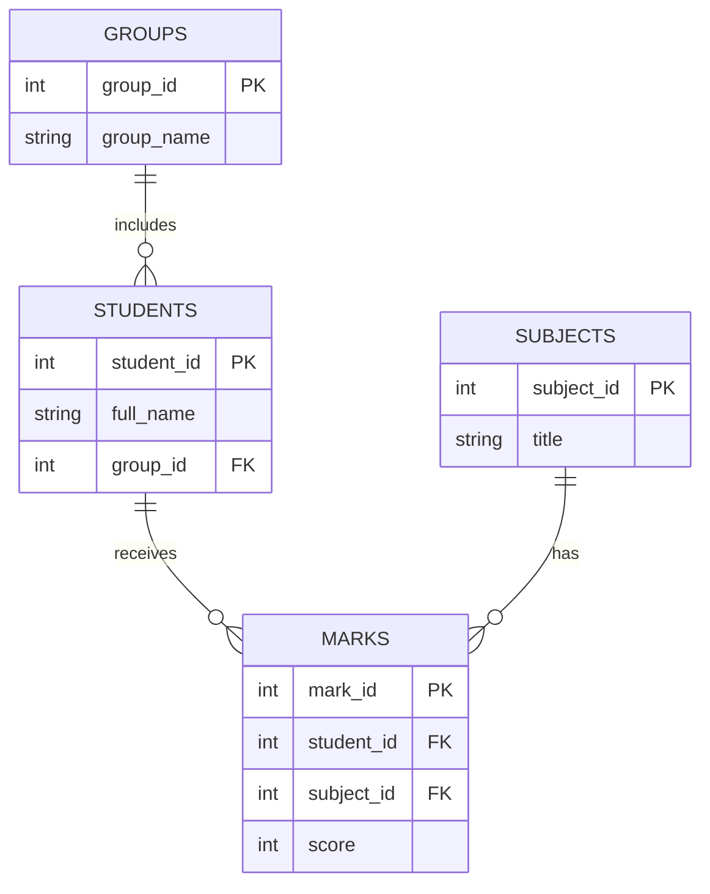

### 4. Виды связей между таблицами
1. **Один к одному (1:1):** одной записи первой таблицы соответствует ровно одна запись второй.
2. **Один ко многим (1:M):** одной записи главной таблицы соответствует несколько записей подчиненной (например, у одной группы много студентов).
3. **Многие ко многим (M:M):** студенты изучают множество предметов, а предмет изучается множеством студентов. Реализуется через промежуточную связующую таблицу (таблица `MARKS`).

---

## Билет 27. Программа подготовки презентаций PowerPoint. Виды презентаций. Создание и настройка презентации (создание фона, вставка текста и рисунков). Настройка анимации. Сортировщик слайдов. Управляющие кнопки. Добавление эффектов мультимедиа

### 1. Назначение и виды компьютерных презентаций
Презентация — это электронный мультимедийный документ, представляющий собой последовательность сменяющих друг друга экранных страниц (**слайдов**).
* **Виды презентаций:**
  * *Презентации для сопровождения устного доклада (спикера):* минимум текста, максимум наглядной инфографики и тезисов;
  * *Интерактивные обучающие презентации:* управляются пользователем с помощью кнопок и гиперссылок;
  * *Автоматические (циклические):* рекламные и информационные табло, работающие без участия человека.

### 2. Создание и оформление слайдов
* **Элементы слайда:** текстовые надписи (WordArt), таблицы, векторные фигуры, растровые изображения, диаграммы SmartArt.
* **Дизайн и макеты:** выбор готовых тем оформления, настройка фона (сплошная заливка, градиент, текстура, изображение), использование режима **Образец слайдов (Slide Master)** для задания единого стиля шрифтов и логотипов на всех слайдах сразу.

### 3. Динамические эффекты и интерактивность
* **Переходы между слайдами (Transitions):** анимационные эффекты смены одного слайда другим с настройкой времени показа и звука.
* **Анимация объектов:**
  * Четыре группы эффектов: *Вход* (появление), *Выделение* (пульсация, изменение цвета), *Выход* (исчезновение), *Пути перемещения*.
  * Настройка условий запуска: по щелчку, с предыдущим, после предыдущего; управление триггерами (запуск по клику на конкретный объект).
* **Интерактивные элементы:**
  * **Управляющие кнопки (Action Buttons)** и гиперссылки: обеспечивают нелинейную навигацию (переход на конкретный слайд, возврат в меню, завершение показа).
* **Мультимедиа:** внедрение фонового аудио (звуковые дорожки) и видеороликов с настройкой автовоспроизведения и затухания.

### 4. Режимы просмотра
* *Обычный* — редактирование текущего слайда;
* *Сортировщик слайдов (Slide Sorter)* — отображение всех слайдов в виде миниатюр для быстрой перестановки порядка, группировки и настройки времени показа;
* *Показ слайдов (F5)* — полноэкранная демонстрация.

---

## Билет 28. Локальные и глобальные компьютерные сети. Структуры (топологии) сетей. Передача информации. Серверы и клиенты. Сеть Интернет. Протокол TCP/IP

### 1. Классификация компьютерных сетей
Компьютерная сеть — объединение вычислительных устройств через каналы связи для совместного использования аппаратных, программных и информационных ресурсов.
* **LAN (Local Area Network, локальные):** объединяют компьютеры в пределах одной комнаты, здания или предприятия (витая пара, Wi-Fi).
* **WAN (Wide Area Network, глобальные):** охватывают города, страны и континенты (Интернет).

### 2. Топологии локальных сетей
Физическая или логическая конфигурация соединений узлов сети:

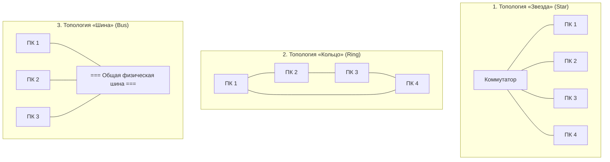

* **Шина (Bus):** общий кабель, к которому подключаются компьютеры. Дешево, но при обрыве кабеля падает вся сеть.
* **Кольцо (Ring):** сигналы передаются последовательно по замкнутому кругу в одном направлении.
* **Звезда (Star):** все компьютеры подключены к центральному узлу (коммутатору/роутеру). Доминирующая топология: выход из строя одного ПК не влияет на остальные.

### 3. Архитектура взаимодействия и сеть Интернет
* **Архитектура «Клиент — Сервер»:**
  * *Сервер* — мощный компьютер с постоянным IP-адресом, предоставляющий сетевые сервисы (Web, FTP, база данных);
  * *Клиент* — рабочая станция пользователя, отправляющая запросы к серверу.
* **Стек протоколов TCP/IP (4 уровня):**
  1. *Прикладной уровень:* HTTP/HTTPS (веб), FTP (файлы), SMTP/IMAP (почта), DNS (разрешение имен в IP-адреса).
  2. *Транспортный уровень:* **TCP** (гарантированная доставка с установлением соединения и контролем целостности пакетов), **UDP** (быстрая передача без подтверждения, стриминг, видеозвонки).
  3. *Сетевой (межсетевой) уровень:* **IP** (маршрутизация пакетов по уникальным IP-адресам узлов, IPv4 — 32 бита, IPv6 — 128 бит).
  4. *Канальный и физический уровень:* Ethernet, Wi-Fi, оптические линии связи.

---

## Билет 29. Язык HTML. Понятие тега. Основные теги. Структура web-страницы. Создание простейшей web-страницы

### 1. Понятие языка HTML
* **HTML (HyperText Markup Language)** — язык гипертекстовой разметки документов, стандарт создания веб-страниц во Всемирной паутине (WWW).
* **Тег** — элемент разметки языка, заключенный в угловые скобки `< >`.
  * *Парные теги:* имеют открывающий и закрывающий тег: `<p>Текст абзаца</p>`.
  * *Одиночные теги:* `<br>` (перенос строки), `` (вставка картинки), `<hr>` (горизонтальная линия).
  * *Атрибуты тегов:* параметры, уточняющие свойства элемента, задаются внутри открывающего тега: `<a href="https://example.com" target="_blank">Ссылка</a>`.

### 2. Базовая структура документа HTML5
Каждая корректная веб-страница имеет строгую структуру:
```html
<!DOCTYPE html>
<html lang="ru">
<head>
    <meta charset="UTF-8">
    <meta name="viewport" content="width=device-width, initial-scale=1.0">
    <title>Заголовок во вкладке браузера</title>
</head>
<body>
    <!-- Видимое содержимое страницы -->
    <h1>Главный заголовок страницы</h1>
    <p>Это пример текстового абзаца с <strong>жирным</strong> и <em>курсивным</em> шрифтом.</p>
</body>
</html>
```

### 3. Основные группы тегов
* **Заголовки:** `<h1>`, `<h2>`, `<h3>`, `<h4>`, `<h5>`, `<h6>` (от самого крупного до мелкого).
* **Текст и списки:**
  * Абзацы: `<p>`.
  * Маркированный список: `<ul><li>Пункт 1</li><li>Пункт 2</li></ul>`.
  * Нумерованный список: `<ol><li>Первый</li><li>Второй</li></ol>`.
* **Гиперссылки и изображения:**
  * Ссылка: `<a href="URL">Текст ссылки</a>`.
  * Рисунок: ``.
* **Таблицы:** `<table>`, `<tr>` (строка), `<th>` (заголовочная ячейка), `<td>` (ячейка данных).

---

## Билет 30. Виды компьютерной графики. Сравнительный анализ векторной и растровой графики. Программное обеспечение для работы с векторной и с растровой графикой. Назначение и возможности

### 1. Основные виды компьютерной графики
1. **Растровая графика:** изображение строится из дискретной сетки окрашенных точек — **пикселей**.
2. **Векторная графика:** изображение формируется из математических геометрических примитивов (точек, линий, кривых Безье, многоугольников, контуров).
3. **Фрактальная графика:** изображение рассчитывается на основе самоподобных математических уравнений (фракталов Мандельброта, Жюлиа).
4. **Трехмерная графика (3D):** моделирование объемных объектов в виртуальном пространстве с последующим рендерингом.

### 2. Сравнительный анализ растровой и векторной графики

| Параметр сравнения | Растровая графика | Векторная графика |
|:---|:---|:---|
| **Элементарная единица** | Пиксель (точка матрицы) | Математический вектор, опорная точка |
| **Масштабирование** | При увеличении теряется четкость, возникает эффект «пикселизации» (ступенчатость) | Масштабируется бесконечно без потери качества |
| **Фотореалистичность** | Идеальна для сложных фотографий с миллионами оттенков | Затруднена; хорошо подходит для чертежей, логотипов, иконок |
| **Зависимость размера файла** | Зависит от физического разрешения ($X \times Y$) и глубины цвета | Зависит только от сложности формул и количества объектов |
| **Популярные форматы** | JPEG, PNG, BMP, GIF, WebP, TIFF | SVG, AI, EPS, CDR |

### 3. Программное обеспечение
* **Для работы с растровой графикой:**
  * Профессиональные пакеты: *Adobe Photoshop*, *GIMP* (свободное ПО), *Corel PaintShop Pro*, *Krita*.
  * Назначение: цветокоррекция, ретушь фотографий, цифровой рисунок, наложение фильтров и эффектов.
* **Для работы с векторной графикой:**
  * Профессиональные пакеты: *Adobe Illustrator*, *Inkscape* (свободное ПО), *CorelDRAW*, *Figma*.
  * Назначение: создание логотипов, полиграфической верстки, шрифтов, схем, чертежей и интерфейсов.
